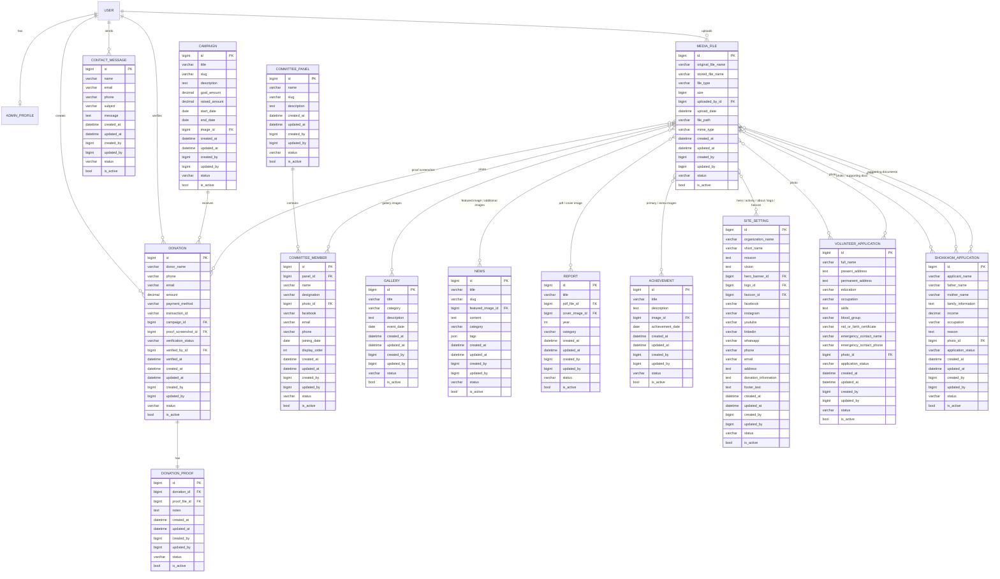

# ER Diagram (Markdown)

```mermaid
erDiagram
    USER ||--o| ADMIN_PROFILE : has
    USER ||--o{ MEDIA_FILE : uploads
    USER ||--o{ DONATION : creates
    USER ||--o{ DONATION : verifies
    USER ||--o{ CONTACT_MESSAGE : sends

    COMMITTEE_PANEL ||--o{ COMMITTEE_MEMBER : contains

    CAMPAIGN ||--o{ DONATION : receives
    DONATION ||--|| DONATION_PROOF : has

    MEDIA_FILE }o--o{ GALLERY : "gallery images"
    MEDIA_FILE }o--o{ NEWS : "featured image / additional images"
    MEDIA_FILE }o--o{ REPORT : "pdf / cover image"
    MEDIA_FILE }o--o{ ACHIEVEMENT : "primary / extra images"
    MEDIA_FILE }o--o{ SITE_SETTING : "hero / activity / about / logo / favicon"
    MEDIA_FILE }o--o{ COMMITTEE_MEMBER : "photo"
    MEDIA_FILE }o--o{ VOLUNTEER_APPLICATION : "photo"
    MEDIA_FILE }o--o{ SHOKKHOM_APPLICATION : "photo / supporting docs"
    MEDIA_FILE }o--o{ DONATION : "proof screenshot"

    VOLUNTEER_APPLICATION }o--|| MEDIA_FILE : "photo"
    SHOKKHOM_APPLICATION }o--|| MEDIA_FILE : "photo"
    SHOKKHOM_APPLICATION }o--o{ MEDIA_FILE : "supporting documents"

    COMMITTEE_PANEL {
        bigint id PK
        varchar name
        varchar slug
        text description
        datetime created_at
        datetime updated_at
        bigint created_by
        bigint updated_by
        varchar status
        bool is_active
    }

    COMMITTEE_MEMBER {
        bigint id PK
        bigint panel_id FK
        varchar name
        varchar designation
        bigint photo_id FK
        varchar facebook
        varchar email
        varchar phone
        date joining_date
        int display_order
        datetime created_at
        datetime updated_at
        bigint created_by
        bigint updated_by
        varchar status
        bool is_active
    }

    CAMPAIGN {
        bigint id PK
        varchar title
        varchar slug
        text description
        decimal goal_amount
        decimal raised_amount
        date start_date
        date end_date
        bigint image_id FK
        datetime created_at
        datetime updated_at
        bigint created_by
        bigint updated_by
        varchar status
        bool is_active
    }

    DONATION {
        bigint id PK
        varchar donor_name
        varchar phone
        varchar email
        decimal amount
        varchar payment_method
        varchar transaction_id
        bigint campaign_id FK
        bigint proof_screenshot_id FK
        varchar verification_status
        bigint verified_by_id FK
        datetime verified_at
        datetime created_at
        datetime updated_at
        bigint created_by
        bigint updated_by
        varchar status
        bool is_active
    }

    DONATION_PROOF {
        bigint id PK
        bigint donation_id FK
        bigint proof_file_id FK
        text notes
        datetime created_at
        datetime updated_at
        bigint created_by
        bigint updated_by
        varchar status
        bool is_active
    }

    GALLERY {
        bigint id PK
        varchar title
        varchar category
        text description
        date event_date
        datetime created_at
        datetime updated_at
        bigint created_by
        bigint updated_by
        varchar status
        bool is_active
    }

    NEWS {
        bigint id PK
        varchar title
        varchar slug
        bigint featured_image_id FK
        text content
        varchar category
        json tags
        datetime created_at
        datetime updated_at
        bigint created_by
        bigint updated_by
        varchar status
        bool is_active
    }

    REPORT {
        bigint id PK
        varchar title
        bigint pdf_file_id FK
        bigint cover_image_id FK
        int year
        varchar category
        datetime created_at
        datetime updated_at
        bigint created_by
        bigint updated_by
        varchar status
        bool is_active
    }

    ACHIEVEMENT {
        bigint id PK
        varchar title
        text description
        bigint image_id FK
        date achievement_date
        datetime created_at
        datetime updated_at
        bigint created_by
        bigint updated_by
        varchar status
        bool is_active
    }

    CONTACT_MESSAGE {
        bigint id PK
        varchar name
        varchar email
        varchar phone
        varchar subject
        text message
        datetime created_at
        datetime updated_at
        bigint created_by
        bigint updated_by
        varchar status
        bool is_active
    }

    MEDIA_FILE {
        bigint id PK
        varchar original_file_name
        varchar stored_file_name
        varchar file_type
        bigint size
        bigint uploaded_by_id FK
        datetime upload_date
        varchar file_path
        varchar mime_type
        datetime created_at
        datetime updated_at
        bigint created_by
        bigint updated_by
        varchar status
        bool is_active
    }

    SITE_SETTING {
        bigint id PK
        varchar organization_name
        varchar short_name
        text mission
        text vision
        bigint hero_banner_id FK
        bigint logo_id FK
        bigint favicon_id FK
        varchar facebook
        varchar instagram
        varchar youtube
        varchar linkedin
        varchar whatsapp
        varchar phone
        varchar email
        text address
        text donation_information
        text footer_text
        datetime created_at
        datetime updated_at
        bigint created_by
        bigint updated_by
        varchar status
        bool is_active
    }

    VOLUNTEER_APPLICATION {
        bigint id PK
        varchar full_name
        text present_address
        text permanent_address
        varchar education
        varchar occupation
        text skills
        varchar blood_group
        varchar nid_or_birth_certificate
        varchar emergency_contact_name
        varchar emergency_contact_phone
        bigint photo_id FK
        varchar application_status
        datetime created_at
        datetime updated_at
        bigint created_by
        bigint updated_by
        varchar status
        bool is_active
    }

    SHOKKHOM_APPLICATION {
        bigint id PK
        varchar applicant_name
        varchar father_name
        varchar mother_name
        text family_information
        decimal income
        varchar occupation
        text reason
        bigint photo_id FK
        varchar application_status
        datetime created_at
        datetime updated_at
        bigint created_by
        bigint updated_by
        varchar status
        bool is_active
    }
```
